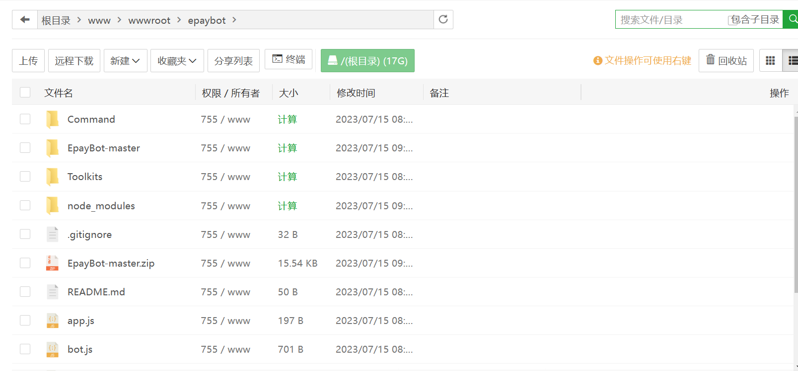
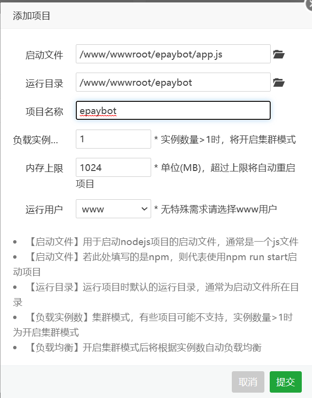
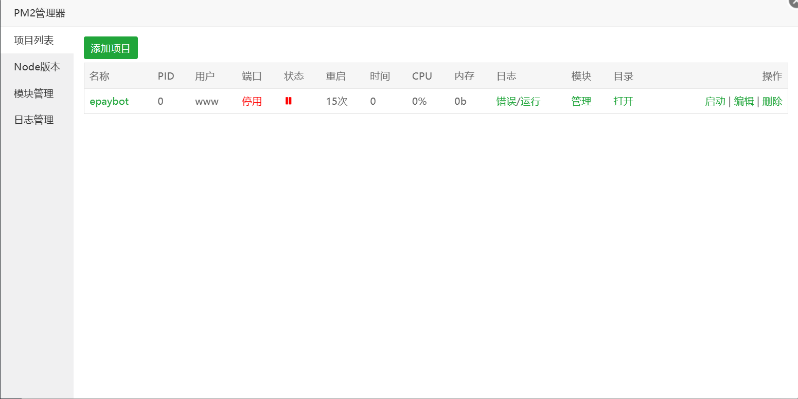
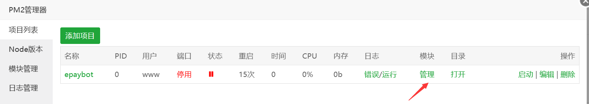
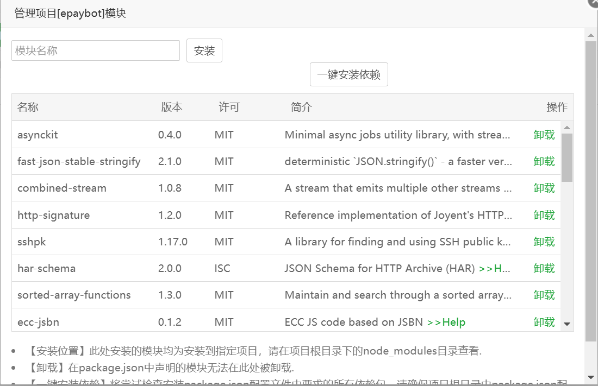
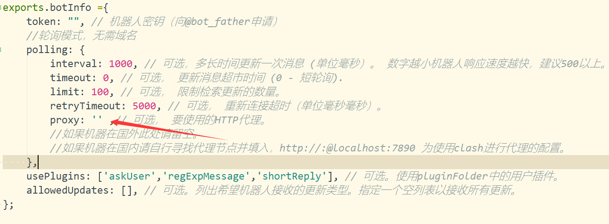

## EpayBot-Nodejs

为你的彩虹易支付增添电报机器人通知功能。

- 无需修改易支付数据库。
- 支持结算通知、订单通知、查看账户信息。
- 代码开源，没有授权及各种费用，代码除特殊说明处外其余可修改。
- 结算信息自动置顶，方便查看
- 


## 使用方式

/start 呼出主菜单

*<u>禁止修改反馈群信息以及免责声明，即保留”欢迎使用易支付机器人“后面内容，如不同意请勿使用本项目。</u>*


/bind 商户号 密钥 绑定账户


## 使用删库塔安装

1. 从软件商店中安装PM2管理器

   

2. 将代码下载到本机下，教程以/www/wwwroot/epaybot目录为例

   并填写config.js里的配置，其中数据库为易支付的数据库。

   **==请认真阅读config.js里面的注释==**

   

3. 打开PM2管理器，找到Node版本，切换到18版本（实测12及以上都可以）

   

4. 然后点击左侧项目列表，点击添加项目，然后点击提交。

   

5. 提交成功后项目会一直重启，这是因为没有安装模块。点击右侧的停止，停止运行项目。

   

6. 然后点击模块下的管理，选择一键安装依赖。安装完成后如下图所示。

   

   

7. 最后点击启动，项目即可正常启动。

## 从命令行安装

1. 安装nvm

   [官方文档 nvm-sh/nvm (github.com)](https://github.com/nvm-sh/nvm/blob/master/README.md#installing-and-updating)

   请按上述官方文档或者谷歌搜索对应系统的安装方式

2. ```shell
   # 安装最新版本
   nvm install node
   ```

3. ```shell
   # 查看可用版本
   nvm ls
   ```

   

4. ```shell
   # 切换版本 版本号按上步骤显示的填
   nvm use 18.12.0
   ```

5. 将代码下载到本机下，教程以/www/wwwroot/epaybot目录为例

   并填写config.js里的配置，其中数据库为易支付的数据库。

   **==请认真阅读config.js里面的注释==**

   ```shell
   #安装依赖模块
   cd /www/wwwroot/epaybot
   npm install
   ```

6. ```shell
   #创建/etc/systemd/system/epaybot.service文件并在文件填写以下内容
   #以nano为例
   sudo nano /etc/systemd/system/epaybot.service
   ```

7. ```ini
   [Unit]
   Description=Epaybot Service
   After=network.target
   Wants=network.target
   
   [Service]
   Type=simple
   
   Restart=always
   WorkingDirectory=/www/wwwroot/epaybot
   ExecStart=node app.js
   
   [Install]
   WantedBy=multi-user.target
   ```

   > 文件内容来源
   >
   > https://t.me/TalkToJshi/1902
   
9. ```shell
    # 加载配置文件
    sudo systemctl daemon-reload
    # 启动服务
    systemctl start epaybot.service
    # 停止服务
    systemctl stop epaybot.service
    # 查看状态
    systemctl status epaybot.service
    # 设置开机启动（可选）
    systemctl enable epaybot.service
    ```


## 获得帮助

https://t.me/TalkToJshi

反馈bug建议直接提交issure，不提供无偿安装搭建服务，教程已经写的很清楚了。

### 赞助

- 可以来这里看看有没有需要的易支付扩展

  [久世凝眸的店铺- 给钱就卖！ (shop.eriver.top)](http://shop.eriver.top/)

- 老婆开的机场

  [rookiecloud](https://rookiecloud.day/#/register?code=3XFHHAJL) 

### 错误处理

1. 以下为数据库链接错误，请检查config.js里的数据库配置

   ```shell
   2023-07-15T16:53:40:   code: 'PROTOCOL_ENQUEUE_AFTER_FATAL_ERROR',
   2023-07-15T16:53:40:   fatal: false
   2023-07-15T16:53:40: }
   2023-07-15T16:53:41: Error: Cannot enqueue Query after fatal error.
   2023-07-15T16:53:41:     at Protocol._validateEnqueue (/www/wwwroot/epaybot/node_modules/mysql/lib/protocol/Protocol.js:212:16)
   2023-07-15T16:53:41:     at Protocol._enqueue (/www/wwwroot/epaybot/node_modules/mysql/lib/protocol/Protocol.js:138:13)
   2023-07-15T16:53:41:     at Connection.query (/www/wwwroot/epaybot/node_modules/mysql/lib/Connection.js:198:25)
   2023-07-15T16:53:41:     at /www/wwwroot/epaybot/Toolkits/dataBase.js:28:15
   2023-07-15T16:53:41:     at new Promise (<anonymous>)
   2023-07-15T16:53:41:     at module.exports (/www/wwwroot/epaybot/Toolkits/dataBase.js:26:9)
   2023-07-15T16:53:41:     at Job.job (/www/wwwroot/epaybot/notify.js:11:3)
   2023-07-15T16:53:41:     at Job.invoke (/www/wwwroot/epaybot/node_modules/node-schedule/lib/Job.js:171:15)
   2023-07-15T16:53:41:     at /www/wwwroot/epaybot/node_modules/node-schedule/lib/Invocation.js:268:28
   2023-07-15T16:53:41:     at Timeout._onTimeout (/www/wwwroot/epaybot/node_modules/node-schedule/lib/
   ```

2. 开启了代理，修改config.js里的proxy

   

   ```shell
   2023-07-15T16:57:02:   code: 'PROTOCOL_ENQUEUE_AFTER_FATAL_ERROR',
   2023-07-15T16:57:02:   fatal: false
   2023-07-15T16:57:02: }
   2023-07-15T16:57:02: [bot.error.webhook] Error: tunneling socket could not be established, cause=connect ECONNREFUSED 127.0.0.1:7890
   2023-07-15T16:57:02:     at ClientRequest.onError (/www/wwwroot/epaybot/node_modules/tunnel-agent/index.js:177:17)
   2023-07-15T16:57:02:     at Object.onceWrapper (events.js:300:26)
   2023-07-15T16:57:02:     at ClientRequest.emit (events.js:210:5)
   2023-07-15T16:57:02:     at Socket.socketErrorListener (_http_client.js:406:9)
   2023-07-15T16:57:02:     at Socket.emit (events.js:210:5)
   2023-07-15T16:57:02:     at emitErrorNT (internal/streams/destroy.js:92:8)
   2023-07-15T16:57:02:     at emitErrorAndCloseNT (internal/streams/destroy.js:60:3)
   2023-07-15T16:57:02:     at processTicksAndRejections (internal/process/task_queues.js:80:21) {
   2023-07-15T16:57:02:   c
   ```

   

