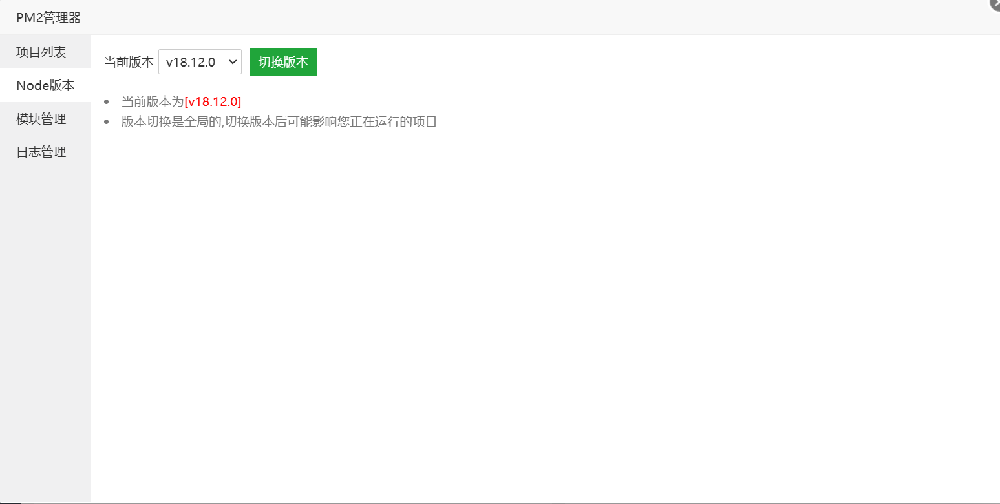

## EpayBot-Nodejs

为你的彩虹易支付增添电报机器人通知功能

无需修改易支付数据库。

代码开源，没有授权及各种费用，随意查看使用和下载。

## 使用方式

/start 呼出主菜单

/bind 商户号 密钥 绑定账户

## 使用删库塔安装

1. 从软件商店中安装PM2管理器

   

2. 将代码下载到本机下，教程以/www/wwwroot/epaybot目录为例

   并填写config.js里的配置，其中数据库为易支付的数据库。

   

3. 打开PM2管理器，找到Node版本，切换到18以上版本

   

4. 然后点击左侧项目列表，点击添加项目，然后点击提交。

   

5. 提交成功后项目会一直重启，这是因为没有安装模块。点击右侧的停止，停止运行项目。

   

6. 然后点击模块下的管理，选择一键安装依赖。安装完成后如下图所示。

   

7. 最后点击启动，项目即可正常启动。
   

## 获得帮助

https://t.me/TalkToJshi

反馈bug建议直接提交issure，不提供无偿安装搭建服务，教程已经写的很清楚了。

